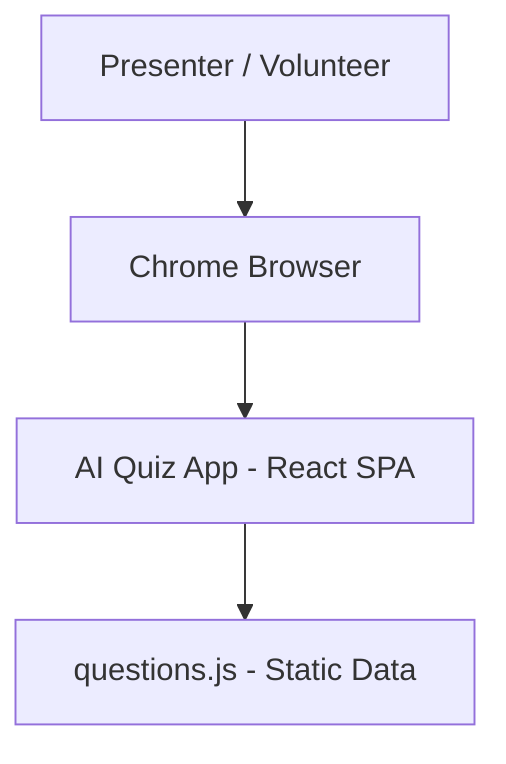
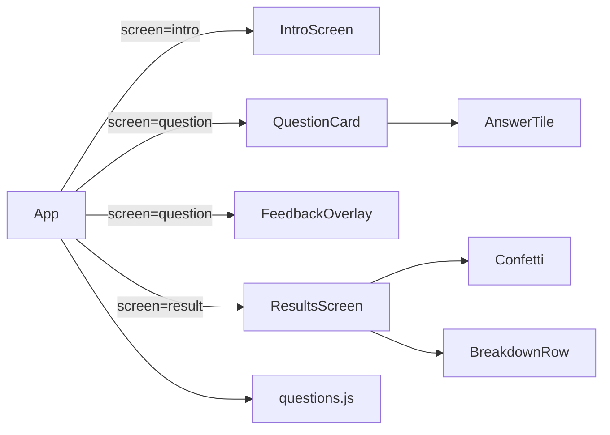
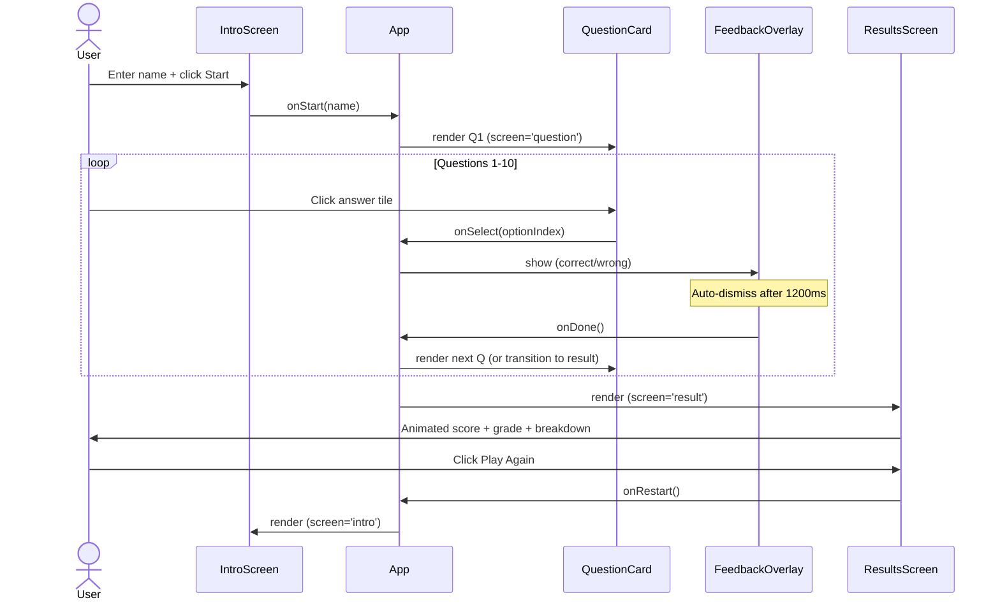
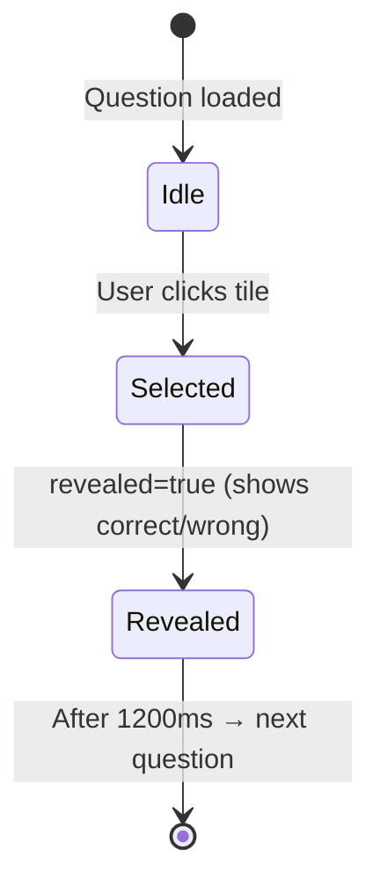

# Solution Design Document

## Validation Checklist

### CRITICAL GATES (Must Pass)

- [x] All required sections are complete
- [x] No [NEEDS CLARIFICATION] markers remain
- [x] Architecture pattern is clearly stated with rationale
- [x] **All architecture decisions confirmed by user**
- [x] Every interface has specification

### QUALITY CHECKS (Should Pass)

- [x] All context sources are listed with relevance ratings
- [x] Project commands are discovered from actual project files
- [x] Constraints → Strategy → Design → Implementation path is logical
- [x] Every component in diagram has directory mapping
- [x] Error handling covers all error types
- [x] Quality requirements are specific and measurable
- [x] Component names consistent across diagrams
- [x] A developer could implement from this design

---

## Constraints

CON-1 **Zero external dependencies beyond Vite + React** — no UI libraries, no Framer Motion, no Redux. Pure CSS animations. Ensures the build is fast and the demo stays simple.

CON-2 **Offline-capable** — must work without internet after `npm install`. All assets self-contained. No API calls at runtime.

CON-3 **Single-session, no persistence** — no backend, no database, no localStorage. State lives only in React memory for the duration of a quiz run.

CON-4 **Browser target** — latest Chrome/Edge on a laptop projected to a screen. No mobile breakpoints required.

---

## Implementation Context

### Required Context Sources

#### Code Context
```yaml
- file: package.json
  relevance: HIGH
  why: "Dependency list and build scripts"

- file: src/data/questions.js
  relevance: HIGH
  why: "Single source of truth for all quiz questions and answers"

- file: src/App.jsx
  relevance: HIGH
  why: "Top-level state machine — owns all quiz state"
```

### Implementation Boundaries

- **Must Preserve**: Nothing (greenfield project)
- **Can Modify**: All files
- **Must Not Touch**: N/A

### External Interfaces

No external API calls at runtime. All data is static.

#### System Context Diagram



### Project Commands

```bash
Install: npm install
Dev:     npm run dev        # http://localhost:5173
Build:   npm run build
Preview: npm run preview
```

---

## Solution Strategy

- **Architecture Pattern**: Single-page React application with a finite state machine at the root (`App.jsx`). No routing library — screen transitions are driven by a `screen` state variable.
- **Integration Approach**: Greenfield. No existing system to integrate with.
- **Justification**: The simplest possible structure that produces a polished result. One `useState` call owns all application state. Components are pure presentational — they receive props and fire callbacks. Zero infrastructure complexity.
- **Key Decisions**:
  - State machine in `App.jsx` (not a library like XState) — keeps it readable and demo-friendly
  - CSS keyframes for all animations — no runtime animation library
  - Static `questions.js` array — no CMS, no fetch, no loading state needed

---

## Building Block View

### Components



**Component responsibilities:**

| Component | Input Props | Callbacks | Responsibility |
|-----------|-------------|-----------|---------------|
| `App` | none | none | State machine, owns all state |
| `IntroScreen` | none | `onStart(name)` | Name entry, start button |
| `QuestionCard` | `question`, `index`, `total`, `selected` | `onSelect(optionIndex)` | Renders question + 4 option tiles + progress |
| `FeedbackOverlay` | `correct`, `visible` | `onDone()` | Green/red flash, auto-dismisses after 1s |
| `ResultsScreen` | `score`, `total`, `answers`, `questions`, `playerName` | `onRestart()` | Score counter, grade badge, breakdown, confetti |
| `AnswerTile` | `label`, `selected`, `correct`, `revealed` | `onClick()` | Single answer option with hover/active states |

### Directory Map

**Component**: `ai-quiz-app`
```
townhall_paul/
├── index.html                    # NEW: Vite entry, loads Inter font from Google Fonts
├── package.json                  # NEW: React + Vite deps
├── vite.config.js                # NEW: Standard Vite React config
└── src/
    ├── main.jsx                  # NEW: ReactDOM.createRoot entry point
    ├── App.jsx                   # NEW: State machine root component
    ├── App.css                   # NEW: Root-level layout styles
    ├── components/
    │   ├── IntroScreen.jsx       # NEW: Landing/name entry screen
    │   ├── IntroScreen.css       # NEW: Intro styles
    │   ├── QuestionCard.jsx      # NEW: Question + answer tiles + progress bar
    │   ├── QuestionCard.css      # NEW: Card styles, animations
    │   ├── AnswerTile.jsx        # NEW: Single answer option
    │   ├── AnswerTile.css        # NEW: Tile hover, selected, correct/wrong states
    │   ├── FeedbackOverlay.jsx   # NEW: Correct/wrong flash overlay
    │   ├── FeedbackOverlay.css   # NEW: Overlay animation
    │   ├── ResultsScreen.jsx     # NEW: Score + grade + breakdown
    │   └── ResultsScreen.css     # NEW: Results styles, confetti animation
    ├── data/
    │   └── questions.js          # NEW: Array of 10 question objects
    └── styles/
        └── global.css            # NEW: CSS variables, reset, typography
```

### Interface Specifications

#### Application Data Models

```pseudocode
# Question object (in questions.js)
ENTITY: Question
  FIELDS:
    id: number (1-10)
    text: string (the question)
    options: string[4] (answer choices)
    correctIndex: number (0-3, index into options[])
    difficulty: 'easy' | 'medium' | 'hard'
    category: 'ai' | 'cricket'
    emoji: string (optional decorative emoji for display)

# App state (in App.jsx useState)
ENTITY: AppState
  FIELDS:
    screen: 'intro' | 'question' | 'result'
    playerName: string
    currentIndex: number          // 0-9
    selectedIndex: number | null  // current question selection
    revealed: boolean             // true after answer is chosen, during feedback
    answers: number[]             // selected option index per question (-1 = unanswered)
    score: number                 // count of correct answers
```

#### Questions Data (Static)

```javascript
// src/data/questions.js — 10 questions total
[
  { id: 1, category: 'ai', difficulty: 'easy',
    text: 'What does "GPT" stand for?',
    options: ['Giant Processing Tool', 'Generative Pre-trained Transformer',
              'Global Pattern Trainer', 'Graphic Processing Technology'],
    correctIndex: 1, emoji: '🤖' },

  { id: 2, category: 'ai', difficulty: 'easy',
    text: 'Which company created ChatGPT?',
    options: ['Google', 'Meta', 'OpenAI', 'Microsoft'],
    correctIndex: 2, emoji: '🏢' },

  { id: 3, category: 'ai', difficulty: 'medium',
    text: 'What architecture powers modern large language models?',
    options: ['LSTM', 'CNN', 'Transformer', 'Recurrent Networks'],
    correctIndex: 2, emoji: '⚙️' },

  { id: 4, category: 'ai', difficulty: 'medium',
    text: 'What is "hallucination" in AI?',
    options: ['An AI dreaming', 'When AI generates false but confident information',
              'A rendering glitch', 'An overheating issue'],
    correctIndex: 1, emoji: '💭' },

  { id: 5, category: 'ai', difficulty: 'medium',
    text: 'What does RAG stand for?',
    options: ['Rapid AI Generation', 'Retrieval-Augmented Generation',
              'Random Algorithmic Guessing', 'Recurrent Attention Graph'],
    correctIndex: 1, emoji: '📚' },

  { id: 6, category: 'ai', difficulty: 'easy',
    text: 'What is a "prompt" in AI?',
    options: ['A stage cue', 'A memory address',
              'The input text you give to an AI model', 'A training dataset'],
    correctIndex: 2, emoji: '💬' },

  { id: 7, category: 'ai', difficulty: 'medium',
    text: 'What is fine-tuning an AI model?',
    options: ['Adjusting screen brightness',
              'Further training on specific data to specialise the model',
              'Deleting bad outputs', 'Compressing model weights'],
    correctIndex: 1, emoji: '🔧' },

  { id: 8, category: 'ai', difficulty: 'medium',
    text: 'Which of these is NOT an AI language model?',
    options: ['Claude', 'GPT-4', 'Gemini', 'Hadoop'],
    correctIndex: 3, emoji: '🔍' },

  { id: 9, category: 'ai', difficulty: 'medium',
    text: 'What does "multimodal" mean in AI?',
    options: ['Having multiple personalities', 'Using many servers',
              'Processing multiple types of input (text, image, audio)',
              'Running on multiple GPUs'],
    correctIndex: 2, emoji: '🎭' },

  { id: 10, category: 'cricket', difficulty: 'hard',
    text: '🏏 Cricket Wildcard! Which Indian batsman holds the world record for most international centuries — and how many?',
    options: ['Sourav Ganguly — 38', 'Virat Kohli — 80',
              'Sachin Tendulkar — 100', 'Rohit Sharma — 55'],
    correctIndex: 2, emoji: '🏏' }
]
```

#### Internal State Transitions

```yaml
State Machine:
  intro:
    TRIGGER: onStart(name)
    NEXT: question
    ACTION: set playerName, reset answers[], score=0, currentIndex=0

  question:
    TRIGGER: onSelect(optionIndex)
    ACTION: set selectedIndex, set revealed=true, update answers[]
    AFTER 1200ms:
      IF currentIndex < 9:
        ACTION: set currentIndex+1, clear selectedIndex, set revealed=false
      ELSE:
        NEXT: result
        ACTION: calculate final score

  result:
    TRIGGER: onRestart()
    NEXT: intro
    ACTION: reset all state to initial values
```

---

## Runtime View

### Primary Flow

#### Flow: Complete Quiz Run

1. User opens app → `IntroScreen` renders with title, tagline, name input
2. User types name → "Start Quiz" button activates
3. User clicks "Start" → App transitions to `question` screen, `currentIndex=0`
4. `QuestionCard` renders Q1 with progress bar at 10%
5. User clicks an answer tile → tile highlights, `FeedbackOverlay` appears (green ✓ or red ✗)
6. After 1.2s, overlay auto-dismisses → next question loads with slide-up animation
7. Steps 4–6 repeat for Q2–Q10
8. After Q10 feedback dismisses → App transitions to `result` screen
9. Score counter animates 0 → final score over 1.5s
10. Grade badge and confetti appear (if score ≥ 8)
11. Per-question breakdown renders row by row
12. User clicks "Play Again" → returns to `IntroScreen`



### Error Handling

- **No internet on load**: Google Fonts will fail silently — browser falls back to `system-ui` sans-serif. App still works.
- **User submits empty name**: "Start Quiz" button remains disabled until `playerName.trim().length > 0`.
- **Double-click on answer**: Once `revealed=true`, all tiles become pointer-events none. No double-submission possible.
- **No JavaScript**: App shows blank page — acceptable for a demo context.

---

## Deployment View

### Single Application Deployment

- **Environment**: Local browser, laptop, projected to screen
- **Configuration**: None required — zero env vars
- **Dependencies**: Node.js + npm (for dev only). Runtime is pure browser JS/CSS/HTML.
- **Performance**: Bundle size target < 200KB gzipped. No lazy loading needed for 10 questions.
- **Running**: `npm run dev` → `http://localhost:5173`

---

## Cross-Cutting Concepts

### User Interface & UX

**Information Architecture:**
- 3 screens only: Intro → Question → Result
- No navigation bar, no back button — linear flow enforced
- Question number always visible in progress bar

**Design System — Apple Aesthetic:**

```yaml
Colors:
  background: "#F5F5F7"   # Apple light grey page
  card: "#FFFFFF"
  accent: "#007AFF"       # SF Blue
  success: "#34C759"      # Apple Green
  error: "#FF3B30"        # Apple Red
  text-primary: "#1D1D1F"
  text-secondary: "#6E6E73"

Typography:
  font-family: 'Inter', system-ui, -apple-system, sans-serif
  heading: 700, 32px, letter-spacing -0.5px
  subheading: 600, 20px
  body: 400, 17px, line-height 1.6

Shape:
  card-radius: 20px
  button-radius: 14px
  tile-radius: 16px
  shadow: "0 4px 24px rgba(0,0,0,0.08)"

Spacing:
  card-padding: 40px
  section-gap: 24px
```

**Interaction Design — Animation Spec:**

```yaml
Screen transition (intro→question, question→result):
  type: fade-in + translateY(20px → 0)
  duration: 400ms
  easing: cubic-bezier(0.16, 1, 0.3, 1)   # spring-like

Answer tile hover:
  transform: translateY(-2px)
  shadow: elevated
  duration: 150ms

Answer tile selection:
  scale: 1.0 → 1.02 → 1.0 (pulse)
  duration: 200ms

FeedbackOverlay:
  type: fade-in from opacity 0
  show-duration: 1200ms then fade-out
  correct: green background + ✓ icon
  wrong: red background + ✗ icon + shake animation on wrong tile

Shake keyframe (wrong answer):
  0%/100%: translateX(0)
  20%/60%: translateX(-8px)
  40%/80%: translateX(8px)
  duration: 400ms

Score counter (results):
  count from 0 to final score
  duration: 1500ms
  easing: ease-out

Confetti (score ≥ 8):
  CSS-only: 20 colored spans, random positions
  animation: fall + spin, staggered delays
  duration: 3s, fill: forwards

Progress bar:
  width: (currentIndex / total) * 100%
  transition: width 300ms ease
```

**Component States — QuestionCard:**



**Grade Badge Logic:**

```
score === 10  → 🏆 "Legend"
score >= 8    → ⭐ "Expert"
score >= 6    → 🎯 "Solid"
score < 6     → 📚 "Keep Learning"
```

### System-Wide Patterns

- **Security**: No user data leaves the browser. No auth. No XSS surface (no user-supplied HTML rendered).
- **Performance**: Static data, no fetches. React renders < 10 components. Target FCP < 1s on any modern laptop.
- **Accessibility**: WCAG AA color contrast on all text. Buttons have accessible labels. Keyboard navigation works on all interactive elements (tiles are `<button>` elements).

---

## Architecture Decisions

- [x] **ADR-1 — No state management library**: Using `useState` in `App.jsx` only.
  - Rationale: 3 screens + 5 state variables. Overkill to add Redux/Zustand/XState for a 10-question quiz.
  - Trade-offs: State is slightly more verbose to pass as props, but trivially readable for the demo audience.
  - User confirmed: **Yes** (selected React + Vite approach in brainstorm)

- [x] **ADR-2 — CSS-only animations**: No Framer Motion or GSAP.
  - Rationale: Fewer dependencies = faster install. CSS keyframes achieve everything needed.
  - Trade-offs: More verbose than Framer Motion API, but no bundle cost.
  - User confirmed: **Yes** (design session)

- [x] **ADR-3 — Co-located CSS files**: Each component has its own `.css` file.
  - Rationale: Keeps styles discoverable alongside components. No CSS-in-JS complexity.
  - Trade-offs: No style scoping (no CSS Modules), but collision risk is negligible with BEM-lite naming.
  - User confirmed: **Yes** (implicit from tech stack choice)

- [x] **ADR-4 — Projected solo play (not multiplayer)**: No WebSocket, no backend.
  - Rationale: Zero infrastructure risk for a live demo. Works offline.
  - Trade-offs: Audience can't play on their phones. Accepted.
  - User confirmed: **Yes** (explicitly chosen in brainstorm)

---

## Quality Requirements

- **Performance**: App loads and is interactive in < 2s on any modern laptop. Quiz transitions feel instant (< 16ms render).
- **Usability**: Text legible at 1080p projected on a large screen. Minimum font size 17px. Click targets minimum 48px height.
- **Reliability**: App never crashes during a 10-question run. No async operations = no failure surface at runtime.
- **Visual**: Apple-like aesthetic — clean, generous whitespace, smooth animations. No stock/generic Bootstrap appearance.

---

## Acceptance Criteria

**Quiz Flow**
- [x] WHEN the user enters their name and clicks Start, THE SYSTEM SHALL begin at question 1 of 10 with a visible progress indicator
- [x] WHEN the user selects an answer, THE SYSTEM SHALL reveal whether it was correct or wrong within 100ms
- [x] WHEN feedback is shown, THE SYSTEM SHALL automatically advance after 1200ms
- [x] WHEN the last question is answered, THE SYSTEM SHALL transition to the results screen

**Gamification**
- [x] THE SYSTEM SHALL animate the score counter from 0 to the final score over 1.5 seconds
- [x] THE SYSTEM SHALL display a grade badge (Legend/Expert/Solid/Keep Learning) based on score
- [x] WHEN score ≥ 8, THE SYSTEM SHALL show a confetti animation
- [x] THE SYSTEM SHALL show a per-question correct/wrong breakdown

**Usability**
- [x] WHILE playerName is empty, THE SYSTEM SHALL disable the Start button
- [x] WHEN an answer is selected, THE SYSTEM SHALL prevent re-selection on the current question
- [x] WHEN Play Again is clicked, THE SYSTEM SHALL reset all state and return to the intro screen

**Cricket Question**
- [x] THE SYSTEM SHALL include exactly one cricket question as question 10
- [x] THE SYSTEM SHALL display a 🏏 indicator on the cricket question

---

## Risks and Technical Debt

### Implementation Gotchas

- **Google Fonts in offline mode**: If the townhall venue has no internet, Inter won't load on first visit. Mitigate by loading the app once before the event to cache the font, or embed Inter as a local woff2.
- **CSS animation jank**: If the laptop is underpowered, CSS `transform` animations could stutter. Use `will-change: transform` on animated elements as a hint.
- **Confetti z-index**: Confetti elements must be positioned `fixed` with a high z-index but `pointer-events: none` so they don't block the Play Again button.

---

## Glossary

### Domain Terms

| Term | Definition | Context |
|------|------------|---------|
| Quiz run | One complete play-through of all 10 questions | Resets on Play Again |
| Wildcard question | The single cricket question mixed into AI content | Question 10, harder difficulty |
| Grade badge | Visual award based on final score | Legend/Expert/Solid/Keep Learning |
| Revealed state | When correct answer is shown after selection | Prevents re-selection, triggers feedback |

### Technical Terms

| Term | Definition | Context |
|------|------------|---------|
| Screen state | `'intro' \| 'question' \| 'result'` string in App state | Drives which component renders |
| FeedbackOverlay | Full-screen translucent flash showing correct/wrong | Auto-dismisses after 1200ms |
| correctIndex | 0-based index into `options[]` pointing to correct answer | Used for scoring and reveal logic |
| SPA | Single Page Application — no page reloads | React renders everything client-side |
